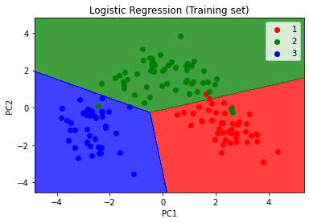
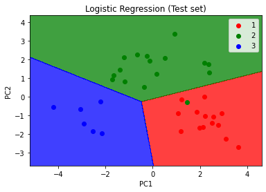

# Portfolio
---
## Natural Language Processing: Tensorflow, Sklearn and Gaussian Naive Bayes Classifier

My complete implementation of NLP on a restaurant review dataset

([GitHub](https://github.com/M-Bhat/NLP/tree/main)).

### Deep Learning Projects
## Detect image of cat or dog: Convolutional Neural Networks 

First, I built a convolutional neural network (CNN) using Tenserflow and Keras libraries. Then, I trained CNN using thousands of images of dogs and cats. Then, I predicted whether a single image is a cat or a dog

## Artificial Neural Network (ANN): Tensorflow,Keras, Sklearn

In this project, I built an ANN using Tensorflow and Keras libraries. Then, I used the Churn Modeling dataset, (which contains details of bank customers) to train this ANN model. Before training the model, the dataset was first preprocessed using the LabelEncoder module from the Sklearn library to encode the gender category data, and then I used OneHotEncoder to encode the country categorical data. Then I used my ANN model to predict whether a particular customer would stay with the bank or not.

### Logistic Regression to the Wine dataset

In this project, I applied principal component analysis (PCA) to the Wine dataset and performed Logistic regression using the Sklearn module.

 

 
 

 

---

© 2020 Khanh Tran. Powered by Jekyll and the Minimal Theme.

